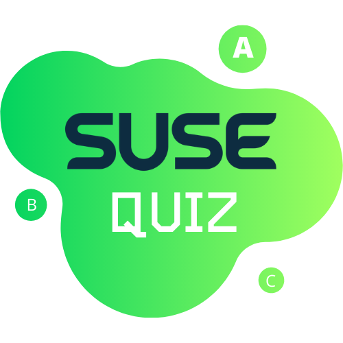

# SUSE Quiz - Hackweek project

This hackweek project is an Unity3D app, available in Android, IOS and HTML5 platforms.

The idea is to welcome new joiners inviting them to play this game. The game will have questions about SUSE, the new joiners will need to ask other SUSE employees for the correct answer, socializing and learning SUSE culture at the same time.
When they win the game an e-mail will be sent to a concrete e-mail address (it might be someone from facilities) and they will receive a small gift as Welcome Pack. For instance, they could receive the small chameleon or a t-shirt.

- [Architecture draft](https://docs.google.com/presentation/d/1Nd-UQr3juwj9_pLxkw4BUIDoNJJESUaPM5bTsUXbZ30)

- [Mockup](https://app.moqups.com/FzcvWkj9bb/view/page/ad64222d5?ui=0)

- [HTML5 version](https://srbarrios.github.io/susequiz/)

- [Backend (Internal SUSE network)](http://susequiz-backend.tf1-c4-lb.cap.suse.de/users/)

# CI

